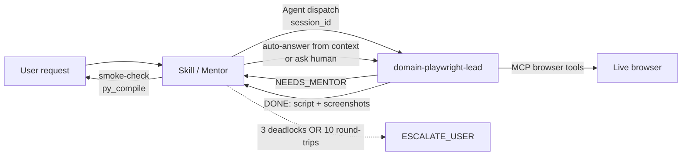

# Skill Factory

Universal skills for AI coding agents. Each skill is a self-contained directory you can drop into your local setup for **Claude Code**, **Gemini CLI**, or **Codex CLI**.

## Supported Platforms

| Platform | Install Path | Format |
|----------|-------------|--------|
| [Claude Code](https://docs.anthropic.com/en/docs/claude-code) | `~/.claude/skills/<skill>/` | SKILL.md |
| [Gemini CLI](https://github.com/google-gemini/gemini-cli) | `~/.gemini/skills/<skill>/` | SKILL.md |
| [Codex CLI](https://github.com/openai/codex) | Project root or `~/.codex/` | AGENTS.md |

## Available Skills

<!-- CATALOG:START -->
| Skill | Description | Platforms | Tags |
|-------|-------------|-----------|------|
| [playwright-autopilot](skills/playwright-autopilot/SKILL.md) | Use when user asks to "automate" a browser task, "write a playwright script", or explicitly mentions playwright automation. Do NOT trigger on general web scraping, testing, or form-filling mentions unless playwright/automation is explicitly referenced. Do NOT trigger on Playwright test writing (use TDD skill instead). | claude-code | `browser` `automation` `playwright` `scraping` `mcp` `subagent` `mentor-consultation` |
| [playwright-autopilot-ts](skills/playwright-autopilot-ts/SKILL.md) | Use when user asks to "automate" a browser task in TypeScript, "write a playwright script in TS/TypeScript", or explicitly mentions TypeScript playwright automation. Do NOT trigger on general web scraping, testing, or form-filling mentions unless playwright/automation + TypeScript is explicitly referenced. Do NOT trigger on Playwright test writing (use TDD skill instead). For Python output, use playwright-autopilot instead. | claude-code | `browser` `automation` `playwright` `scraping` `mcp` `typescript` |
<!-- CATALOG:END -->

## Featured Skills

### Playwright Autopilot v4 — Companion Agent with Mentor Consultation (Python)

> The skill is the mentor. A dedicated subagent drives the browser. When it gets confused, it **asks instead of guessing**.

v4 is a structural shift. Previous versions packed the full playbook — Goal Lock, Smart Recon, pattern recognition, layered debug — into a single skill body that the main thread executed directly. v4 splits the work:

- **The skill** (`skills/playwright-autopilot/SKILL.md`) is a dispatcher. It runs on the main thread, spawns the companion agent, answers its questions, and enforces a round-trip ceiling.
- **The companion agent** (`.claude/agents/domain-playwright-lead.md`) owns all MCP browser work. Its tool whitelist restricts it to Playwright MCP calls only — physically preventing substitution of `requests` / `httpx` / BeautifulSoup.

When the agent hits a branch it can't resolve — selector collision, missing credentials, unclear intent, layout drift, three failed debug attempts — it returns a structured `NEEDS_MENTOR` block and stops. The mentor auto-answers from the original user goal and prior conversation turns when inferable, otherwise asks the human. A deadlock counter hashed on `(checkpoint, blocker_category)` plus a hard ceiling (**10 round-trips OR 3 deadlocks → escalate**) prevents runaway loops.



**Why it's different:**
- **Tool whitelist as a safety rail** — agent frontmatter is the enforcement point, not prose. No path to non-Playwright substitutes.
- **Mentor consultation** — ambiguity is surfaced, not papered over. The agent never fabricates a selector or credential.
- **Bounded cooperation** — deadlock counter + round-trip ceiling ensure the loop terminates.
- **Session-isolated state** — each run writes to `.claude/agent-memory/domain-playwright-lead/sessions/<id>/state.json` (gitignored).
- **All v3 principles preserved** — Goal Lock, Smart Recon, Pattern Recognition, Snapshot-first, Layered Debug now live inside the agent.

> **Claude Code only.** The mentor-consultation pattern requires Claude Code's project-scoped subagent dispatch, which Gemini CLI and Codex CLI don't support. The `platforms:` field in frontmatter is a real build filter — `dist/gemini-cli/playwright-autopilot/` and `dist/codex-cli/playwright-autopilot/` are intentionally absent. Pin tag `v3.1.0` if you need the earlier cross-platform inline playbook.

| Variant | Language | Platforms | Pattern |
|---------|----------|-----------|---------|
| [playwright-autopilot](skills/playwright-autopilot/SKILL.md) | Python | claude-code | v4 dispatcher + companion agent |
| [playwright-autopilot-ts](skills/playwright-autopilot-ts/SKILL.md) | TypeScript | claude-code, gemini-cli, codex-cli | v3-style inline playbook |

[See the Python showcase &rarr;](skills/playwright-autopilot/README.md) &nbsp;|&nbsp; [See the TypeScript docs &rarr;](skills/playwright-autopilot-ts/README.md)

## Installation

### Option 1: Copy from dist/ (recommended)

Clone this repo and copy the pre-built skill for your platform:

```bash
git clone https://github.com/aghaPathan/skill-factory.git
```

**Claude Code:**
```bash
cp -r skill-factory/dist/claude-code/<skill-name> ~/.claude/skills/
```

**Gemini CLI:**
```bash
cp -r skill-factory/dist/gemini-cli/<skill-name> ~/.gemini/skills/
```

**Codex CLI:**
```bash
cp skill-factory/dist/codex-cli/<skill-name>/AGENTS.md ./AGENTS.md
```

> **Skills with companion agents.** Some skills (e.g., `playwright-autopilot` v4) ship a Claude-Code-only subagent under `.claude/agents/`. Copy that file alongside the skill so the dispatcher can spawn it:
> ```bash
> mkdir -p ~/.claude/agents
> cp skill-factory/.claude/agents/domain-playwright-lead.md ~/.claude/agents/
> ```
> Or run Claude Code from within the cloned `skill-factory/` directory — project-scoped agents are auto-discovered from `.claude/agents/` with no install step.

### Option 2: Copy source directly

If your platform uses SKILL.md (Claude Code, Gemini CLI):
```bash
cp -r skill-factory/skills/<skill-name> ~/.claude/skills/
# or
cp -r skill-factory/skills/<skill-name> ~/.gemini/skills/
```

## Skill Structure

```
skills/<skill-name>/
├── SKILL.md          # Skill definition with YAML frontmatter (source of truth)
└── evals/
    └── evals.json    # Evaluation test cases
```

### SKILL.md Frontmatter

```yaml
---
name: skill-name                    # Required — skill identifier
description: When to trigger        # Required — activation criteria
version: 1.0.0                      # Optional — semver
tags: [tag1, tag2]                  # Optional — for catalog filtering
platforms: [claude-code, gemini-cli, codex-cli]  # Optional — target platforms
author: github-username             # Optional — contributor attribution
---
```

## Development

```bash
npm install          # Install dependencies
npm run validate     # Check skill frontmatter + platform compatibility
npm run eval-check   # Structural checks on SKILL.md content
npm test             # Run unit tests (27 tests across adapters, validation, catalog)
npm run build        # Generate dist/ files + update README catalog
```

CI runs all of the above on every PR via GitHub Actions, plus verifies `dist/` is up to date.

## Contributing

See [CONTRIBUTING.md](CONTRIBUTING.md) for the full guide.

Quick start:
1. Create `skills/<your-skill>/SKILL.md` with frontmatter
2. Add `evals/evals.json` with test cases
3. Run `npm run validate && npm run eval-check && npm test`
4. Run `npm run build` to generate dist/ files
5. Submit a PR

## License

MIT
