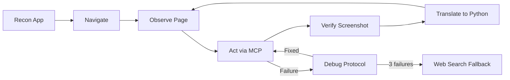

# Skill Factory

Universal skills for AI coding agents. Each skill is a self-contained directory you can drop into your local setup for **Claude Code**, **Gemini CLI**, or **Codex CLI**.

## Supported Platforms

| Platform | Install Path | Format |
|----------|-------------|--------|
| [Claude Code](https://docs.anthropic.com/en/docs/claude-code) | `~/.claude/skills/<skill>/` | SKILL.md |
| [Gemini CLI](https://github.com/google-gemini/gemini-cli) | `~/.gemini/skills/<skill>/` | SKILL.md |
| [Codex CLI](https://github.com/openai/codex) | Project root or `~/.codex/` | AGENTS.md |

## Available Skills

<!-- CATALOG:START -->
| Skill | Description | Platforms | Tags |
|-------|-------------|-----------|------|
| [playwright-autopilot](skills/playwright-autopilot/SKILL.md) | Use when user asks to "automate" a browser task, "write a playwright script", or explicitly mentions playwright automation. Do NOT trigger on general web scraping, testing, or form-filling mentions unless playwright/automation is explicitly referenced. Do NOT trigger on Playwright test writing (use TDD skill instead). | claude-code, gemini-cli, codex-cli | `browser` `automation` `playwright` `scraping` `mcp` |
| [playwright-autopilot-ts](skills/playwright-autopilot-ts/SKILL.md) | Use when user asks to "automate" a browser task in TypeScript, "write a playwright script in TS/TypeScript", or explicitly mentions TypeScript playwright automation. Do NOT trigger on general web scraping, testing, or form-filling mentions unless playwright/automation + TypeScript is explicitly referenced. Do NOT trigger on Playwright test writing (use TDD skill instead). For Python output, use playwright-autopilot instead. | claude-code, gemini-cli, codex-cli | `browser` `automation` `playwright` `scraping` `mcp` `typescript` |
<!-- CATALOG:END -->

## Featured Skills

### Playwright Autopilot v2

> Your AI agent thinks like a developer — explores the app, builds the script step by step, and debugs failures methodically.

Most browser automation starts with writing a script and hoping it works. Playwright Autopilot flips this: the agent **maps the target application first** (routes, auth, API patterns), then opens a real browser via MCP tools, interacts with pages step by step, and **translates each action into Python code as it goes**. When something breaks, it follows a full DevTools-style debug protocol instead of blindly retrying.



**Why it's different:**
- **App reconnaissance first** — maps pages, auth gates, and API patterns before writing a single line of automation
- **Developer-style debugging** — failures trigger a systematic investigation: DOM inspection, console logs, network requests, and JS evaluation — not blind retries
- **Web search when stuck** — after 3 failed hypotheses, asks permission to search Playwright docs for help
- **Production-grade output** — every script is a class with CLI args, logging, error handling, and accessible selectors

[See the full showcase &rarr;](skills/playwright-autopilot/README.md)

## Installation

### Option 1: Copy from dist/ (recommended)

Clone this repo and copy the pre-built skill for your platform:

```bash
git clone https://github.com/aghaawais/skill-factory.git
```

**Claude Code:**
```bash
cp -r skill-factory/dist/claude-code/<skill-name> ~/.claude/skills/
```

**Gemini CLI:**
```bash
cp -r skill-factory/dist/gemini-cli/<skill-name> ~/.gemini/skills/
```

**Codex CLI:**
```bash
cp skill-factory/dist/codex-cli/<skill-name>/AGENTS.md ./AGENTS.md
```

### Option 2: Copy source directly

If your platform uses SKILL.md (Claude Code, Gemini CLI):
```bash
cp -r skill-factory/skills/<skill-name> ~/.claude/skills/
# or
cp -r skill-factory/skills/<skill-name> ~/.gemini/skills/
```

## Skill Structure

```
skills/<skill-name>/
├── SKILL.md          # Skill definition with YAML frontmatter (source of truth)
└── evals/
    └── evals.json    # Evaluation test cases
```

### SKILL.md Frontmatter

```yaml
---
name: skill-name                    # Required — skill identifier
description: When to trigger        # Required — activation criteria
version: 1.0.0                      # Optional — semver
tags: [tag1, tag2]                  # Optional — for catalog filtering
platforms: [claude-code, gemini-cli, codex-cli]  # Optional — target platforms
author: github-username             # Optional — contributor attribution
---
```

## Contributing

See [CONTRIBUTING.md](CONTRIBUTING.md) for the full guide.

Quick start:
1. Create `skills/<your-skill>/SKILL.md` with frontmatter
2. Add `evals/evals.json` with test cases
3. Run `npm run build` to generate dist/ files
4. Submit a PR

## License

MIT
