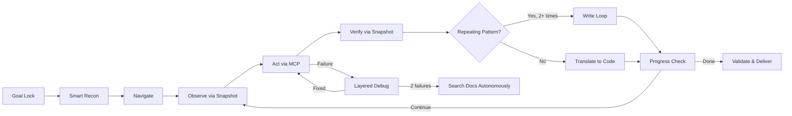

# Skill Factory

Universal skills for AI coding agents. Each skill is a self-contained directory you can drop into your local setup for **Claude Code**, **Gemini CLI**, or **Codex CLI**.

## Supported Platforms

| Platform | Install Path | Format |
|----------|-------------|--------|
| [Claude Code](https://docs.anthropic.com/en/docs/claude-code) | `~/.claude/skills/<skill>/` | SKILL.md |
| [Gemini CLI](https://github.com/google-gemini/gemini-cli) | `~/.gemini/skills/<skill>/` | SKILL.md |
| [Codex CLI](https://github.com/openai/codex) | Project root or `~/.codex/` | AGENTS.md |

## Available Skills

<!-- CATALOG:START -->
| Skill | Description | Platforms | Tags |
|-------|-------------|-----------|------|
| [playwright-autopilot](skills/playwright-autopilot/SKILL.md) | Use when user asks to "automate" a browser task, "write a playwright script", or explicitly mentions playwright automation. Do NOT trigger on general web scraping, testing, or form-filling mentions unless playwright/automation is explicitly referenced. Do NOT trigger on Playwright test writing (use TDD skill instead). | claude-code, gemini-cli, codex-cli | `browser` `automation` `playwright` `scraping` `mcp` |
| [playwright-autopilot-ts](skills/playwright-autopilot-ts/SKILL.md) | Use when user asks to "automate" a browser task in TypeScript, "write a playwright script in TS/TypeScript", or explicitly mentions TypeScript playwright automation. Do NOT trigger on general web scraping, testing, or form-filling mentions unless playwright/automation + TypeScript is explicitly referenced. Do NOT trigger on Playwright test writing (use TDD skill instead). For Python output, use playwright-autopilot instead. | claude-code, gemini-cli, codex-cli | `browser` `automation` `playwright` `scraping` `mcp` `typescript` |
<!-- CATALOG:END -->

## Featured Skills

### Playwright Autopilot v3 — Anti-Drift Prompt Design

> Your AI agent locks a goal, explores a live browser, builds the script one action at a time, and stops when done.

Most browser automation starts with writing a script and hoping it works. Playwright Autopilot flips this: the agent **registers your goal** (Goal Lock), opens a real browser via MCP tools, interacts with pages step by step, and **translates each verified action into code as it goes**. When it detects repeating patterns (pagination, table rows), it generalizes to a loop instead of exhaustively iterating. When something breaks, it follows a layered debug protocol — Quick Check first, Full Investigation only if needed.

Available in **Python** and **TypeScript**:



> **Note:** This flow is enforced via structured prompt instructions, not runtime code. The agent follows these steps because the skill's rules direct it to — compliance depends on the LLM's instruction-following capability.

**Why it's different:**
- **Goal Lock** — agent registers goal, task plan, and done criteria before any browser action. Re-reads at every phase transition to prevent drift.
- **Proportional recon** — SKIP for simple tasks (1 snapshot), LIGHT for unknown pages, FULL only for multi-page auth-gated flows
- **Pattern Recognition** — generalizes repeating patterns to code loops after 2 iterations. Prevents visiting all 50 pages via MCP.
- **Snapshot-first observation** — accessibility tree (~2-5KB) as primary tool, screenshots (~100KB+) only for visual layout, debug escalation, or final delivery
- **Layered debugging** — Quick Check (1 step) before Full Investigation (4 steps). Searches Playwright docs autonomously after 2 failures.
- **Production-grade output** — class-based scripts with CLI args, logging, error handling, and accessible selectors

| Variant | Language | Runtime | Skill |
|---------|----------|---------|-------|
| [playwright-autopilot](skills/playwright-autopilot/SKILL.md) | Python | `python script.py` | `playwright.sync_api`, argparse, logging |
| [playwright-autopilot-ts](skills/playwright-autopilot-ts/SKILL.md) | TypeScript | `npx tsx script.ts` | async/await, zero deps beyond playwright |

[See the Python showcase &rarr;](skills/playwright-autopilot/README.md) &nbsp;|&nbsp; [See the TypeScript docs &rarr;](skills/playwright-autopilot-ts/README.md)

## Installation

### Option 1: Copy from dist/ (recommended)

Clone this repo and copy the pre-built skill for your platform:

```bash
git clone https://github.com/aghaPathan/skill-factory.git
```

**Claude Code:**
```bash
cp -r skill-factory/dist/claude-code/<skill-name> ~/.claude/skills/
```

**Gemini CLI:**
```bash
cp -r skill-factory/dist/gemini-cli/<skill-name> ~/.gemini/skills/
```

**Codex CLI:**
```bash
cp skill-factory/dist/codex-cli/<skill-name>/AGENTS.md ./AGENTS.md
```

### Option 2: Copy source directly

If your platform uses SKILL.md (Claude Code, Gemini CLI):
```bash
cp -r skill-factory/skills/<skill-name> ~/.claude/skills/
# or
cp -r skill-factory/skills/<skill-name> ~/.gemini/skills/
```

## Skill Structure

```
skills/<skill-name>/
├── SKILL.md          # Skill definition with YAML frontmatter (source of truth)
└── evals/
    └── evals.json    # Evaluation test cases
```

### SKILL.md Frontmatter

```yaml
---
name: skill-name                    # Required — skill identifier
description: When to trigger        # Required — activation criteria
version: 1.0.0                      # Optional — semver
tags: [tag1, tag2]                  # Optional — for catalog filtering
platforms: [claude-code, gemini-cli, codex-cli]  # Optional — target platforms
author: github-username             # Optional — contributor attribution
---
```

## Development

```bash
npm install          # Install dependencies
npm run validate     # Check skill frontmatter + platform compatibility
npm run eval-check   # Structural checks on SKILL.md content
npm test             # Run unit tests (27 tests across adapters, validation, catalog)
npm run build        # Generate dist/ files + update README catalog
```

CI runs all of the above on every PR via GitHub Actions, plus verifies `dist/` is up to date.

## Contributing

See [CONTRIBUTING.md](CONTRIBUTING.md) for the full guide.

Quick start:
1. Create `skills/<your-skill>/SKILL.md` with frontmatter
2. Add `evals/evals.json` with test cases
3. Run `npm run validate && npm run eval-check && npm test`
4. Run `npm run build` to generate dist/ files
5. Submit a PR

## License

MIT
