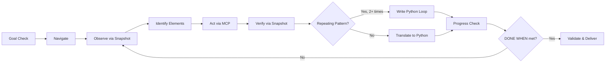

# Playwright Autopilot

**Your AI agent explores a live browser and hands you the Python script that reproduces every action — and asks for help instead of guessing when it hits a branch it can't resolve.**

## What It Does

Playwright Autopilot turns your AI coding agent into a browser automation engineer. Instead of writing a Playwright script from scratch and hoping it works, the agent opens a real browser via MCP tools, interacts with pages step by step, and translates each successful action into Python code — building your automation script incrementally as it explores.

The result is a production-grade, class-based Python script that's been validated against the live site before you ever run it.

## v4 — Companion Agent with Mentor Consultation (current)

v4 splits the skill into a **dispatcher** (main thread, mentor) and a **companion subagent** (`domain-playwright-lead`) that owns all MCP browser work.

- The agent's tool whitelist is restricted to `mcp__plugin_playwright_playwright__*` plus Read/Write/Edit/Bash/Glob/Grep. There is no path to `requests`, `httpx`, or BeautifulSoup — the runtime blocks it, not just the prose.
- When the agent hits ambiguity — two selectors match, credentials are missing, intent is unclear, layout drifted, or three debug attempts failed — it returns a structured `NEEDS_MENTOR` block with `session_id`, `checkpoint`, `blocker_category`, and an options list. It stops and waits.
- The mentor (skill, running on the main thread) auto-answers from the original user goal and prior turns when the answer is inferable; otherwise it asks the human. Then it respawns the agent with `RESUME session <id>. Mentor answer: …`.
- A deadlock counter — owned by the mentor, hashed on `(checkpoint + blocker_category)` — plus a hard ceiling of **10 round-trips OR 3 deadlocks → escalate to user** prevents runaway loops.
- Session state lives at `.claude/agent-memory/domain-playwright-lead/sessions/<id>/state.json` (gitignored; the agent auto-creates the dir on first use).

**Platforms:** Claude Code only. Mentor consultation requires project-scoped subagent dispatch, which Gemini CLI and Codex CLI don't support. The `platforms:` field in frontmatter is a real build filter, so `dist/gemini-cli/playwright-autopilot/` and `dist/codex-cli/playwright-autopilot/` are intentionally absent. If you need cross-platform inline support, pin tag `v3.1.0`.

## v3 Architecture — Anti-Drift Design (now lives inside the agent)

Everything below was v3's anti-drift playbook. In v4 these principles are preserved verbatim — they've just moved into `.claude/agents/domain-playwright-lead.md` so they're the agent's standing instructions rather than instructions the main thread has to re-rehearse on every invocation.

### Goal Lock

Before touching the browser, the agent registers your goal:
- **GOAL**: One-sentence restatement of what you asked for
- **TASK PLAN**: 2-6 numbered sub-tasks with checkboxes
- **DONE WHEN**: Observable completion criteria

The agent re-reads this at every phase transition. If it catches itself doing something not in the plan — it stops.

### Smart Recon (Proportional Exploration)

Not every task needs deep exploration. v3 scales reconnaissance to complexity:

| Tier | When | Cost |
|------|------|------|
| **SKIP** | Single-page, static content | 1 snapshot (~3KB) |
| **LIGHT** | Unknown page structure | 1-2 snapshots (~6KB) |
| **FULL** | Multi-page, auth-gated, SPA | 3-5 snapshots (~15KB) |

v2 always explored 3-5 routes (15K-40K tokens). v3 defaults to SKIP.

### Pattern Recognition

When the agent detects a repeating pattern (pagination, table rows, list items), it **stops iterating via MCP after 2 pages** and writes a Python loop instead. This prevents the catastrophic scenario where the agent visits all 50 pages of a paginated site via browser tools.

### Snapshot-First Observation

`browser_snapshot` (accessibility tree, ~2-5KB) is the primary observation tool. Screenshots (~100KB+) are reserved for three specific cases: visual layout verification, debug escalation, and final delivery. This saves 50-80% of context window tokens.

### Layered Debug

Failures don't trigger a monolithic 5-tool investigation. v3 tries a **Quick Check** first (1 snapshot + 1 hypothesis), escalating to Full Investigation only if needed. Non-technical failures (wrong credentials, CAPTCHAs) get immediate escalation — no wasted hypotheses.

## The Development Loop



### How Each Step Works

1. **Goal Check** — Re-read Goal Lock. Which sub-task am I on?
2. **Navigate** — `browser_navigate` (skip if already on target page)
3. **Observe** — `browser_snapshot` (primary). Screenshot only if layout matters.
4. **Identify** — Find elements from snapshot using accessible selectors
5. **Act** — One MCP interaction (click, fill, type, select)
6. **Verify** — `browser_snapshot` to confirm success
7. **Pattern?** — Am I repeating something? If yes after 2 iterations → write a loop
8. **Translate** — Append Python line(s) to the growing script
9. **Progress** — Mark sub-task done. Is DONE WHEN met? → Stop or continue

**Step 8 is critical.** After every MCP action, the agent writes the Python equivalent immediately.

**Step 9 is the exit gate.** When DONE WHEN is met, the agent stops. No bonus features.

## Key Features

| Feature | Description |
|---------|-------------|
| **Goal Lock** | Agent registers goal + task plan + done criteria before any browser action |
| **Smart Recon** | Proportional exploration — SKIP for simple tasks, FULL only when needed |
| **Pattern Recognition** | Generalizes repeating patterns to Python loops after 2 iterations |
| **Snapshot-First** | Accessibility tree (~2-5KB) as primary observation, not screenshots (~100KB+) |
| **Layered Debug** | Quick Check (1 step) before Full Investigation (4 steps) |
| **Live Browser Exploration** | Agent drives a real browser via MCP tools |
| **Incremental Building** | Python code grows one action at a time |
| **Class-Based Output** | Production template with `setup()`, `teardown()`, and `step_NN_*` methods |
| **CLI-Ready** | `--headed`, `--verbose`, `--url` flags via argparse |
| **No Hardcoded Secrets** | Credentials always via `os.environ["VAR"]` |
| **Context Budget Aware** | Explicit guidance on staying within token limits |

## What Makes v3 Different

| | v2 (Drift-Prone) | v3 (Anti-Drift) |
|---|---|---|
| **Goal tracking** | None — agent forgets what it was asked to do | Goal Lock re-read at every phase transition |
| **Exit condition** | "REPEAT" with no termination | Explicit DONE WHEN gate at step 9 |
| **Recon** | Always explore 3-5 routes (15K-40K tokens) | Tiered: SKIP/LIGHT/FULL (3K-15K tokens) |
| **Observation** | Screenshot + Snapshot every step (~105KB) | Snapshot-first (~3KB), screenshots for 3 cases |
| **Pagination** | Visit every page via MCP (200K+ tokens) | Pattern Recognition → Python loop after 2 pages |
| **Debug** | 5-tool investigation for every failure | Quick Check first, Full Investigation if needed |
| **Auth-gated apps** | Explores routes behind login (fails) | Detects auth, skips exploration, authenticates first |

## Example Use Cases

**Web Scraping** — "Extract all book titles and prices from books.toscrape.com"
> Agent locks goal, does SKIP recon (one snapshot), extracts data incrementally, saves to CSV. For paginated sites, generalizes to a loop after 2 pages.

**Login Automation** — "Log into the-internet.herokuapp.com and verify the success message"
> Agent locks goal, does LIGHT recon, detects auth form, fills credentials from env vars, verifies success message, stops when DONE WHEN is met.

**File Download** — "Download files from the-internet.herokuapp.com/download"
> Agent locks goal, sets up download handling with `accept_downloads=True`, clicks download, saves file. Quick Check debug if download fails.

**50-Page Scrape** — "Get all book titles from all pages of books.toscrape.com"
> Agent visits pages 1-2, recognizes pagination pattern, writes a Python loop for all 50 pages. Does NOT visit all 50 pages via MCP.

## Quick Install

**Claude Code (only platform supported in v4):**

```bash
# 1. Copy the skill
cp -r skills/playwright-autopilot ~/.claude/skills/

# 2. Copy the companion agent
mkdir -p ~/.claude/agents
cp .claude/agents/domain-playwright-lead.md ~/.claude/agents/
```

Or, simpler: run Claude Code from inside the cloned `skill-factory/` directory. Claude Code auto-discovers project-scoped agents from `.claude/agents/`, so no install step is needed.

**Gemini CLI / Codex CLI:** not supported in v4. Pin `v3.1.0` (inline playbook, no companion agent):

```bash
git checkout v3.1.0 -- skills/playwright-autopilot
```

## Prerequisites

- An MCP server providing Playwright browser tools (`browser_navigate`, `browser_click`, `browser_snapshot`, `browser_take_screenshot`, etc.)
- Python 3.8+ with `playwright` package installed (`pip install playwright && playwright install`)
