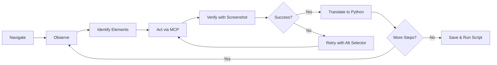

# Playwright Autopilot

**Your AI agent explores a live browser and hands you the Python script that reproduces every action.**

## What It Does

Playwright Autopilot turns your AI coding agent into a browser automation engineer. Instead of writing a Playwright script from scratch and hoping it works, the agent opens a real browser via MCP tools, interacts with pages step by step, and translates each successful action into Python code — building your automation script incrementally as it explores.

The result is a production-grade, class-based Python script that's been validated against the live site before you ever run it.

## The Development Loop

This is the core workflow that makes Playwright Autopilot unique:



### How Each Step Works

1. **Navigate** — Agent uses MCP `browser_navigate` to open the target URL
2. **Observe** — Takes a screenshot + DOM snapshot to understand the page
3. **Identify** — Finds interactive elements using role/text/label selectors (accessible-first)
4. **Act** — Performs the action via MCP tools (click, fill, type, select)
5. **Verify** — Takes another screenshot to confirm the action succeeded
6. **Translate** — Immediately appends the equivalent Python Playwright line to the growing script
7. **Repeat** — Loops back to Observe for the next action

**Step 6 is critical.** The agent doesn't batch-write code at the end. After every single MCP action, it writes the Python equivalent. The script grows line by line, in lockstep with live exploration.

## Salient Features

| Feature | Description |
|---------|-------------|
| **Live Browser Exploration** | Agent drives a real browser via MCP tools — no guessing at selectors or page structure |
| **Incremental Script Building** | Python code grows one action at a time, never written all at once |
| **Adaptive Screenshots** | Normal mode: screenshots at key transitions. Alert mode: screenshot after every action when errors occur |
| **Failure Recovery** | Element not found? Tries 2 alternative selectors. Unexpected page? Dismisses popups and retries. 3 failures? Asks for help |
| **Class-Based Output** | Every script follows a production template with `setup()`, `teardown()`, and numbered `step_NN_*` methods |
| **CLI-Ready** | All scripts ship with `--headed`, `--verbose`, and `--url` flags via argparse |
| **CAPTCHA-Aware** | Detects CAPTCHAs, pauses execution, and inserts `input()` prompts for human intervention |
| **No Hardcoded Secrets** | Credentials always use `os.environ["VAR"]` with no fallback defaults |
| **Accessible Selectors** | Prefers `get_by_role()`, `get_by_text()`, `get_by_label()` over brittle CSS/XPath |
| **End-to-End Validation** | After building the script, runs it to verify it works — up to 3 fix attempts |

## What Makes This Different

| | Traditional Approach | Autopilot Approach |
|---|---|---|
| **Start** | Write full script based on docs/guessing | Open the browser and look at the page |
| **Selectors** | Inspect HTML, copy selectors, hope they work | Agent reads the live DOM, picks accessible selectors |
| **Debugging** | Run script, hit error, read traceback, fix, repeat | Each action is verified before moving on |
| **Error handling** | Added after the fact when things break | Built in as the script is constructed |
| **Output** | Varies wildly by developer | Consistent class-based template every time |
| **Confidence** | "I think this should work" | "I watched it work, then wrote the code" |

## Example Use Cases

**Web Scraping** — "Extract all book titles and prices from books.toscrape.com"
> Agent navigates to the site, snapshots the page, identifies the book grid, extracts data into a CSV — building a reusable scraper class the whole time.

**Login Automation** — "Log into the-internet.herokuapp.com and verify the success message"
> Agent navigates to the login page, fills credentials from env vars, clicks submit, verifies the flash message — each step becomes a `step_NN` method.

**File Download** — "Download files from the-internet.herokuapp.com/download"
> Agent sets up download handling with `accept_downloads=True`, clicks the download link, saves the file — complete with `expect_download()` patterns.

## Quick Install

**Claude Code:**
```bash
cp -r skills/playwright-autopilot ~/.claude/skills/
```

**Gemini CLI:**
```bash
cp -r skills/playwright-autopilot ~/.gemini/skills/
```

**Codex CLI:**
```bash
cp dist/codex-cli/playwright-autopilot/AGENTS.md ./AGENTS.md
```

## Prerequisites

- An MCP server providing Playwright browser tools (`browser_navigate`, `browser_click`, `browser_snapshot`, `browser_take_screenshot`, etc.)
- Python 3.8+ with `playwright` package installed (`pip install playwright && playwright install`)
